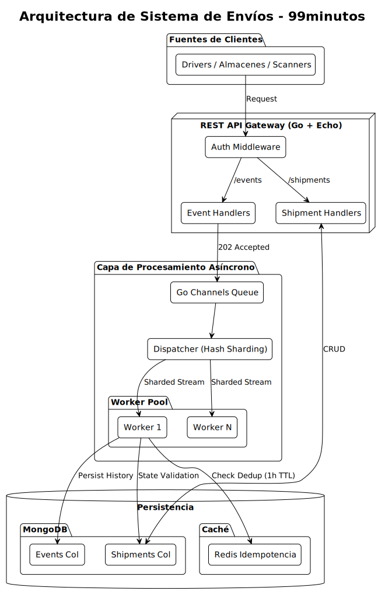
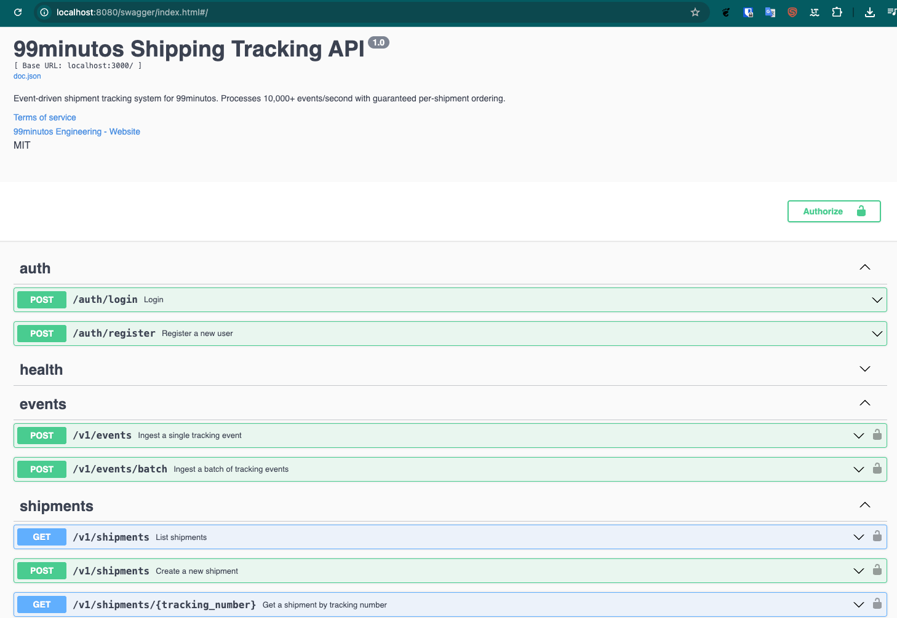
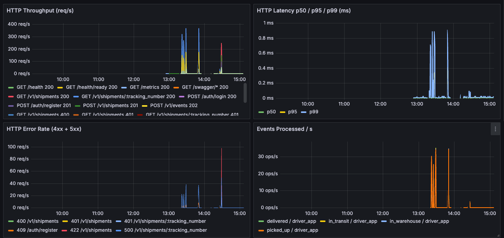
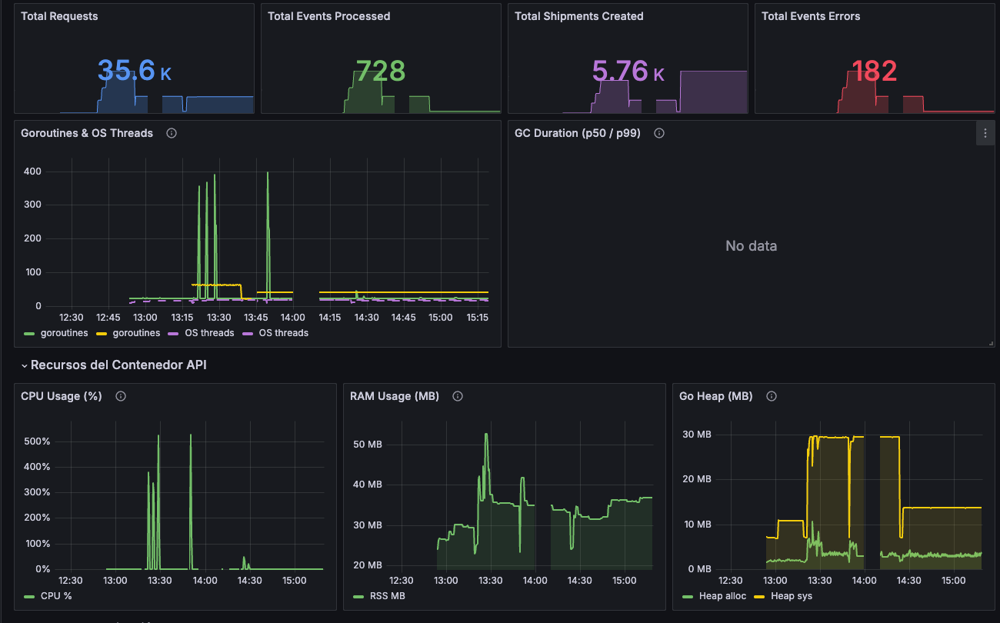

# Sistema de Seguimiento de Envíos — 99minutos

API REST orientada a eventos para el seguimiento en tiempo real de envíos logísticos. Construida con Go 1.25 y Echo v4, diseñada para procesar más de 10,000 eventos por segundo con ordenamiento garantizado por envío e idempotencia nativa.

---

## Tabla de contenidos

1. [Descripción general](#descripción-general)
2. [Arquitectura](#arquitectura)
3. [Stack tecnológico](#stack-tecnológico)
4. [Decisiones de diseño](#decisiones-de-diseño)
5. [Inicio rápido](#-inicio-rápido)
6. [Documentación de la API](#-documentación-de-la-api)
7. [Pruebas](#pruebas)
8. [Observabilidad](#-observabilidad)
9. [Escalabilidad](#escalabilidad)
10. [Trade-offs y consideraciones de producción](#trade-offs-y-consideraciones-de-producción)
11. [Estructura del proyecto](#estructura-del-proyecto)
12. [Comandos de desarrollo](#comandos-de-desarrollo)
13. [Licencia](#licencia)

---

## Descripción general

Sistema de seguimiento de envíos para una empresa de logística latinoamericana. Permite:

- Registrar envíos con números de rastreo únicos en formato `99M-<8-char>`
- Recibir actualizaciones de estado en tiempo real desde múltiples fuentes (choferes, bodegas, escáneres)
- Mantener un historial de auditoría completo por envío
- Exponer una REST API segura con control de acceso basado en roles (RBAC)
- Procesar alta concurrencia con target de 10,000+ eventos por segundo

---

## Arquitectura

### Diagrama de alto nivel



### Clean Architecture — tres capas

```
internal/domain/          ← Entidades de negocio y máquina de estados (sin dependencias externas)
internal/application/     ← Casos de uso y DTOs (depende solo del dominio)
internal/infrastructure/  ← Handlers HTTP, MongoDB, Redis, cola de eventos
```

Las capas externas nunca se filtran hacia las internas. Cada capa conoce únicamente a la que está directamente por debajo.

### Esquema de colecciones MongoDB

```javascript
// Colección: shipments
{
  _id: ObjectId,
  tracking_number: "99M-ABC12345",      // Único, indexado
  client_id: "client_001",
  origin: {
    address: "Calle 5 #123, Ciudad de México",
    coordinates: { lat: 19.4326, lng: -99.1332 }
  },
  destination: {
    address: "Avenida Paseo #456, Puebla",
    coordinates: { lat: 19.0327, lng: -98.2064 }
  },
  package: {
    weight_kg: 5.5,
    dimensions: { length: 30, width: 20, height: 15 },
    content_description: "Electronics"
  },
  current_status: "in_transit",
  created_at: ISODate("2025-02-12T10:00:00Z"),
  updated_at: ISODate("2025-02-12T15:04:05Z"),
  // Desnormalizado para lecturas en una sola consulta
  status_history: [
    { status: "created",    timestamp: ISODate(...), source: "api",              location: null },
    { status: "picked_up",  timestamp: ISODate(...), source: "driver_app",       location: { lat: 19.4327, lng: -99.1331 } },
    { status: "in_transit", timestamp: ISODate(...), source: "driver_app",       location: { lat: 19.4326, lng: -99.1332 } }
  ]
}

// Colección: status_events (pista de auditoría)
{
  _id: ObjectId,
  tracking_number: "99M-ABC12345",
  shipment_id: ObjectId,
  status: "in_transit",
  timestamp: ISODate(...),
  source: "driver_app",
  location: { lat: 19.4326, lng: -99.1332 },
  idempotency_key: "dedup:<tracking>:<source>:<unix_ts>",
  created_at: ISODate(...)
}

// Colección: auth_users
{
  _id: ObjectId,
  username: "client_user_001",
  password_hash: "<bcrypt>",
  role: "client",
  client_id: "client_001",
  created_at: ISODate(),
  updated_at: ISODate()
}
```

---

## Stack tecnológico

| Componente | Tecnología | Justificación |
|-----------|-----------|---------------|
| Lenguaje | Go 1.25 | Concurrencia nativa, bajo uso de recursos, tipado estático |
| Framework web | Echo v4.12+ | Middleware ecosystem maduro, binding + validación integrados |
| Base de datos | MongoDB 7 | Modelo de documento natural para envíos con historial embebido; TTL indexes para limpieza automática |
| Cache / Dedup | Redis 7 | Verificación de duplicados O(1); TTL configurable por clave |
| Cola de eventos | Go Channels + Worker Pool | Concurrencia nativa; sin dependencias externas; escala a 1M/s con Kafka cuando sea necesario |
| Autenticación | JWT (golang-jwt) | Stateless, escalable, estándar de la industria |
| Testing | testify + k6 | Pruebas unitarias e integración con testify; carga y E2E con k6 |
| Logging | slog (stdlib) | Logging estructurado sin dependencias externas |
| Validación | go-playground/validator | Validación por struct tags; integrado con el binder de Echo |
| Observabilidad | Prometheus + Grafana + cAdvisor | Métricas de negocio personalizadas; dashboards pre-aprovisionados |
| Documentación API | Swagger / swaggo | OpenAPI 2.0 autogenerado desde anotaciones en el código |
| Contenedores | Docker + Docker Compose | Entorno reproducible para desarrollo local |

---

## Decisiones de diseño

### 1. Per-Shipment Channel — canal por envío

**Problema:** Procesar 10K eventos por segundo de forma concurrente garantizando que los eventos del mismo envío se procesen en orden.

**Solución:** Un canal de Go independiente por `tracking_number`.

```
shipment_1: [event1] → [event2] → [event3]   (serial, en orden)
shipment_2: [eventA] → [eventB]               (serial, en orden)
shipment_3: [eventX]                          (serial, en orden)

Todos los envíos se procesan en PARALELO entre sí.
Los eventos de un mismo envío se procesan en ORDEN garantizado.
```

**Implementación:**
- `map[tracking_number]chan *Event` protegido con `sync.RWMutex`
- Canal creado de forma lazy al primer evento del envío
- Una goroutine worker por canal; buffer de 100 (backpressure)

**Trade-offs:**
- Ordenamiento garantizado por envío
- Paralelismo total entre envíos distintos
- Sin dependencias externas
- El número de envíos activos está limitado por memoria disponible (mitigado con pooling de canales inactivos)

---

### 2. Estrategia de idempotencia

**Problema:** Los eventos duplicados por reintentos o problemas de red deben manejarse de forma segura.

**Solución:** Deduplicación por clave compuesta en Redis + registro de auditoría en MongoDB.

```go
// Clave de deduplicación en Redis (SETEX atómico)
key := fmt.Sprintf("dedup:%s:%s:%d", tracking_number, source, timestamp.Unix())

// Si SET tiene éxito → evento nuevo → procesar
// Si SET falla    → duplicado     → descartar
```

La clave compuesta previene duplicados de la misma fuente en el mismo instante, pero permite que distintas fuentes actualicen el mismo envío simultáneamente y que la misma fuente envíe eventos en momentos distintos.

- Verificación en Redis: O(1), muy baja latencia
- TTL de 1 hora previene acumulación de memoria
- Persistencia en MongoDB para auditoría y cumplimiento normativo

---

### 3. State machine — máquina de estados

**Problema:** Prevenir transiciones de estado inválidas (por ejemplo, `delivered → in_warehouse`).

**Solución:** Whitelist de transiciones permitidas definida exclusivamente en la capa de dominio.

```
created → picked_up → in_warehouse → in_transit → delivered
    └──────────────────────────────────────────→ cancelled

picked_up    → cancelled
in_warehouse → cancelled
in_transit   → cancelled
```

```go
var validTransitions = map[Status][]Status{
    Created:     {PickedUp, Cancelled},
    PickedUp:    {InWarehouse, Cancelled},
    InWarehouse: {InTransit, Cancelled},
    InTransit:   {Delivered},
    Delivered:   {},
    Cancelled:   {},
}
```

Esta lógica reside en `internal/domain/status.go` y se prueba de forma independiente, sin mezclarla con la infraestructura.

---

### 4. Respuesta asíncrona — 202 Accepted

**Problema:** El cliente envía un evento que se encola de forma asíncrona. ¿Qué código HTTP responder?

**Decisión:** `202 Accepted` con el evento encolado.

```http
POST /events
→ HTTP/1.1 202 Accepted

{
  "event_id": "evt_xyz123",
  "status": "queued",
  "tracking_number": "99M-ABC12345",
  "message": "Event accepted for processing"
}
```

- `202` es el estándar HTTP para procesamiento asíncrono: indica que la solicitud fue recibida pero aún no procesada.
- `200 OK` implicaría procesamiento completo (incorrecto en este contexto).
- `201 Created` implicaría creación de recurso (engañoso).

---

### 5. Desnormalización del historial de estados

**Problema:** Las consultas `GET /shipments/:id` necesitan el envío y su historial completo en una sola llamada.

**Decisión:** El array `status_history` se embebe directamente en el documento del envío.

- Una sola consulta retorna el historial completo, sin joins.
- Actualización atómica (ACID).
- Uso natural del modelo de documentos de MongoDB.
- Limitación: el documento crece con el tiempo (límite de 16 MB de MongoDB). Si los historiales superan los 100K eventos por envío, migrar a colección separada con `$lookup`.

---

### 6. Autenticación y autorización (RBAC)

**Implementación:**
- Tokens JWT — stateless, sin sesión en servidor
- Claims: `sub` (username), `role` (`client` / `admin`), `client_id`
- El middleware verifica la firma y extrae los claims en cada endpoint protegido; los handlers confían en los claims del middleware

**Roles:**
- `client`: ve únicamente sus propios envíos, filtrado por el `client_id` del token
- `admin`: ve todos los envíos, sin restricción de `client_id`

**Usuarios pre-cargados en la base de datos:**

| Usuario | Contraseña | Rol | client_id |
|---------|-----------|-----|-----------|
| `admin_user` | `password123` | admin | — |
| `client_user_001` | `password123` | client | `client_001` |

---

## 🚀 Inicio rápido

### Requisitos previos

- Go 1.21 o superior
- Docker y Docker Compose
- Make (recomendado)

### Opción A: Docker Compose (recomendado)

```bash
# 1. Clonar el repositorio
git clone <repo-url>
cd 99minutos

# 2. Levantar todos los servicios (MongoDB, Redis, API)
make docker-up

# 3. Verificar que la API responde
curl http://localhost:8080/health
# → {"status":"ok"}
```

### Opción B: Desarrollo local (solo infraestructura en Docker)

```bash
# Levantar solo MongoDB y Redis
docker compose up -d mongo redis

# Instalar dependencias
go mod download

# Ejecutar el servidor (carga configs/.env.local)
make run
```

### Variables de entorno

Copiar la plantilla y ajustar los valores:

```bash
cp configs/.env.example configs/.env
```

```env
PORT=8080
ENV=development

MONGO_URI=mongodb://mongo:27017
MONGO_DB=shipping_system

REDIS_ADDR=redis:6378
REDIS_DB=0

JWT_SECRET=change-me-in-production

LOG_LEVEL=info
```

### Verificar la instalación

```bash
# MongoDB
docker compose exec mongo mongosh --eval "db.version()"

# Redis
docker compose exec redis redis-cli ping
# → PONG

# API
curl http://localhost:8080/health
# → {"status":"ok"}
```

---

## 📖 Documentación de la API

### Swagger UI

  

La API incluye una especificación OpenAPI 2.0 generada con [swaggo](https://github.com/swaggo/swag).

| URL | Descripción |
|-----|-------------|
| `http://localhost:8080/swagger/index.html` | Swagger UI interactivo |
| `http://localhost:8080/swagger/doc.json` | Especificación OpenAPI en JSON |

Para regenerar la especificación tras modificar las anotaciones de los handlers:

```bash
make swagger
```

---

### Autenticación

Todos los endpoints protegidos requieren un token JWT en el header `Authorization`:

```bash
Authorization: Bearer <token>
```

**Obtener token:**

```bash
curl -X POST http://localhost:8080/auth/login \
  -H "Content-Type: application/json" \
  -d '{"username": "admin_user", "password": "password123"}'
```

```json
{
  "token": "eyJhbGciOiJIUzI1NiIsInR5cCI6IkpXVCJ9...",
  "expires_in": 86400,
  "token_type": "Bearer"
}
```

---

### Endpoints

#### Crear envío

```http
POST /shipments
Content-Type: application/json
Authorization: Bearer <token>

{
  "origin_address": "Calle 5 #123, Ciudad de México",
  "origin_lat": 19.4326,
  "origin_lng": -99.1332,
  "destination_address": "Avenida Paseo #456, Puebla",
  "destination_lat": 19.0327,
  "destination_lng": -98.2064,
  "weight_kg": 5.5,
  "length_cm": 30,
  "width_cm": 20,
  "height_cm": 15,
  "content_description": "Electronics",
  "client_id": "client_001"
}
```

```http
HTTP/1.1 201 Created

{
  "tracking_number": "99M-ABC12345",
  "status": "created",
  "created_at": "2025-02-12T10:00:00Z",
  "client_id": "client_001"
}
```

---

#### Consultar envío

```http
GET /shipments/99M-ABC12345
Authorization: Bearer <token>
```

```http
HTTP/1.1 200 OK

{
  "tracking_number": "99M-ABC12345",
  "client_id": "client_001",
  "current_status": "in_transit",
  "origin": {
    "address": "Calle 5 #123, Ciudad de México",
    "coordinates": { "lat": 19.4326, "lng": -99.1332 }
  },
  "destination": {
    "address": "Avenida Paseo #456, Puebla",
    "coordinates": { "lat": 19.0327, "lng": -98.2064 }
  },
  "package": {
    "weight_kg": 5.5,
    "dimensions": { "length": 30, "width": 20, "height": 15 },
    "content_description": "Electronics"
  },
  "created_at": "2025-02-12T10:00:00Z",
  "updated_at": "2025-02-12T15:04:05Z",
  "status_history": [
    { "status": "created",      "timestamp": "2025-02-12T10:00:00Z", "source": "api",               "location": null },
    { "status": "picked_up",    "timestamp": "2025-02-12T10:15:00Z", "source": "driver_app",        "location": { "lat": 19.4327, "lng": -99.1331 } },
    { "status": "in_warehouse", "timestamp": "2025-02-12T12:30:00Z", "source": "warehouse_scanner", "location": null },
    { "status": "in_transit",   "timestamp": "2025-02-12T15:04:05Z", "source": "driver_app",        "location": { "lat": 19.4326, "lng": -99.1332 } }
  ]
}
```

---

#### Listar envíos

```http
GET /shipments?status=in_transit&limit=10&offset=0
Authorization: Bearer <token>
```

```http
HTTP/1.1 200 OK

{
  "data": [
    {
      "tracking_number": "99M-ABC12345",
      "client_id": "client_001",
      "current_status": "in_transit",
      "created_at": "2025-02-12T10:00:00Z",
      "updated_at": "2025-02-12T15:04:05Z"
    }
  ],
  "pagination": {
    "total": 45,
    "limit": 10,
    "offset": 0,
    "has_next": true
  }
}
```

**Parámetros de consulta:**

| Parámetro | Tipo | Descripción |
|-----------|------|-------------|
| `status` | string | `created`, `picked_up`, `in_warehouse`, `in_transit`, `delivered`, `cancelled` |
| `client_id` | string | Filtrar por cliente (solo role: `admin`) |
| `limit` | int | Resultados por página (default: 10, max: 100) |
| `offset` | int | Desplazamiento para paginación (default: 0) |

---

#### Publicar evento

```http
POST /events
Content-Type: application/json
Authorization: Bearer <token>

{
  "tracking_number": "99M-ABC12345",
  "status": "in_transit",
  "timestamp": "2025-02-12T15:04:05Z",
  "source": "driver_app",
  "location": { "lat": 19.4326, "lng": -99.1332 }
}
```

```http
HTTP/1.1 202 Accepted

{
  "event_id": "evt_xyz123abc",
  "status": "queued",
  "tracking_number": "99M-ABC12345",
  "message": "Event accepted for processing"
}
```

---

#### Publicar lote de eventos

```http
POST /events/batch
Content-Type: application/json
Authorization: Bearer <token>

{
  "events": [
    {
      "tracking_number": "99M-ABC12345",
      "status": "in_transit",
      "timestamp": "2025-02-12T15:04:05Z",
      "source": "driver_app",
      "location": { "lat": 19.4326, "lng": -99.1332 }
    },
    {
      "tracking_number": "99M-DEF45678",
      "status": "picked_up",
      "timestamp": "2025-02-12T15:05:00Z",
      "source": "driver_app",
      "location": { "lat": 19.4327, "lng": -99.1331 }
    }
  ]
}
```

```http
HTTP/1.1 202 Accepted

{
  "received": 2,
  "queued": 2,
  "message": "All events accepted for processing"
}
```

---

#### Health check

```http
GET /health
```

```http
HTTP/1.1 200 OK

{
  "status": "ok",
  "timestamp": "2025-02-12T15:10:00Z",
  "checks": {
    "database": "ok",
    "cache": "ok",
    "event_queue": "ok"
  }
}
```

---

### Códigos de respuesta y errores

Todos los errores siguen este formato:

```json
{
  "error": "INVALID_TRANSITION",
  "message": "Cannot transition from 'in_transit' to 'picked_up'",
  "status_code": 400,
  "timestamp": "2025-02-12T15:10:00Z"
}
```

| Código | Significado | Ejemplo |
|--------|-------------|---------|
| 200 | OK | GET exitoso |
| 201 | Created | Envío creado |
| 202 | Accepted | Evento encolado para procesamiento asíncrono |
| 400 | Bad Request | JSON inválido o campos faltantes |
| 401 | Unauthorized | Token ausente o inválido |
| 403 | Forbidden | Cliente intentando ver envíos de otro cliente |
| 404 | Not Found | Número de rastreo no encontrado |
| 409 | Conflict | Transición de estado inválida |
| 500 | Internal Server Error | Error inesperado del servidor |

---

## Pruebas

El proyecto cuenta con dos capas de pruebas complementarias: pruebas Go (unitarias e integración) y pruebas black-box con k6 sobre la API en ejecución.

### Pruebas Go

```bash
# Todas las pruebas
go test ./...

# Solo pruebas unitarias
go test ./test/unit/... -v

# Con race detector (obligatorio antes de hacer commit)
go test -race ./...

# Reporte de cobertura (HTML)
go test -coverprofile=coverage.out ./... && go tool cover -html=coverage.out -o coverage.html

# Prueba específica por nombre
go test ./test/unit/... -run TestValidTransitions -v
```

Atajos con Make:

```bash
make test           # Ejecutar todas las pruebas
make test-race      # Con race detector
make test-coverage  # Generar reporte HTML
```

**Objetivos de cobertura:** dominio 95% · capa de aplicación 85% · infraestructura 70% · global 80%+

---

### Pruebas k6

Las pruebas k6 corren contra la API HTTP en ejecución. Cubren autenticación, envíos, eventos y el ciclo de vida completo (incluyendo idempotencia, aislamiento de RBAC, paginación y validación de la state machine).

**Instalar k6:** https://k6.io/docs/get-started/installation/

```bash
# Requisito: la API debe estar en ejecución
make docker-up
```

| Archivo | Alcance | Qué cubre |
|---------|---------|-----------|
| `test/k6/auth.test.js` | Integración | Login, validación de token, credenciales incorrectas, RBAC en rutas protegidas |
| `test/k6/shipments.test.js` | Integración | Creación, consulta por número de rastreo, listado con paginación y filtros, aislamiento de RBAC |
| `test/k6/events.test.js` | Integración | Evento único, batch, deduplicación, transiciones inválidas, casos límite de validación |
| `test/k6/e2e.test.js` | End-to-end | Ciclo completo: crear envío → recorrer las 5 transiciones → verificar historial en cada paso → aislamiento RBAC |

```bash
make test-k6        # Ejecutar todas las suites k6
make test-k6-e2e    # Solo el escenario end-to-end

# Contra un entorno diferente
BASE_URL=http://staging.example.com k6 run test/k6/e2e.test.js
```

**Thresholds por defecto** (definidos en `test/k6/config.js`):

```
http_req_failed       < 1%     (tasa de error)
http_req_duration p95 < 3s     (latencia)
checks                = 100%   (todas las aserciones deben pasar)
```

---

## 📊 Observabilidad

Todos los servicios de observabilidad arrancan automáticamente con `make docker-up`. No se requiere configuración adicional.

### URLs

| Servicio | URL | Credenciales |
|---------|-----|-------------|
| Grafana | `http://localhost:3000` | admin / admin |
| Prometheus | `http://localhost:9090` | — |
| cAdvisor | `http://localhost:8081` | — |
| Métricas API | `http://localhost:8080/metrics` | — |

### Dashboard de Grafana

El dashboard `deployments/grafana/dashboards/shipping_api.json` se provisiona automáticamente al arrancar. Incluye:

**Capa HTTP**
- Throughput (req/s) por método, URL y código de estado
- Latencia p50 / p95 / p99 por endpoint
- Tasa de error (4xx + 5xx)

  


**Pipeline de procesamiento de eventos**
- Eventos procesados/s por estado y fuente
- Duración de procesamiento p50 / p95
- Profundidad de cola por worker
- Tasa de hits de deduplicación
- Envíos creados/s

**Go runtime**
- Goroutines y OS threads (detección de leaks)
- Duración de GC p50 / p99

**Recursos del proceso**
- CPU (%), RSS memory (MB)
- Go heap: allocado vs reservado

  

### Métricas Prometheus personalizadas

| Métrica | Tipo | Labels |
|--------|------|--------|
| `shipping_http_requests_total` | Counter | `method`, `url`, `code` |
| `shipping_http_request_duration_seconds` | Histogram | `method`, `url` |
| `shipping_events_processed_total` | Counter | `status`, `source` |
| `shipping_events_errors_total` | Counter | `reason` |
| `shipping_events_dedup_total` | Counter | `result` |
| `shipping_events_queue_depth` | Gauge | `worker_id` |
| `shipping_event_processing_duration_seconds` | Histogram | `status` |
| `shipping_shipments_created_total` | Counter | `service_type` |

---

## Escalabilidad

### Capacidad actual

```
Go Channels + 10 Workers:
├─ Throughput:        ~1,000,000 eventos/segundo
├─ Latencia p50:      50–100 ms
├─ Latencia p99:      200–500 ms
├─ Memoria (10K ev):  ~50 MB
└─ CPU (10K ev/s):    ~1 núcleo
```

La arquitectura actual tiene margen amplio para el target de 10K eventos/segundo.

### Fases de escalado

#### Fase 1: Actual (10K – 100K eventos/s)

- Go channels con worker pool
- Instancia única de MongoDB con replicación
- Redis standalone
- Instancia única de la API

Despliegue: Docker Compose o Kubernetes.

---

#### Fase 2: Alto volumen (100K – 1M eventos/s)

Componentes a reemplazar:

1. **Cola de mensajes:** Go Channels → Apache Kafka (topic por partición, ordenamiento por `tracking_number` como partition key)
2. **Base de datos:** MongoDB single node → MongoDB Cluster con sharding por `tracking_number`
3. **Cache:** Redis standalone → Redis Cluster
4. **API:** Instancia única → Múltiples instancias detrás de un Load Balancer

La abstracción de la cola permite cambiar la implementación sin modificar los handlers:

```go
type EventPublisher interface {
    Publish(ctx context.Context, event *Event) error
}

var publisher EventPublisher = &ChannelPublisher{}  // Desarrollo
var publisher EventPublisher = &KafkaPublisher{}    // Producción
```

---

#### Fase 3: Escala extrema (1M+ eventos/s)

Patrones avanzados a considerar:

- **Event Sourcing:** los eventos son la fuente de verdad; las proyecciones son modelos de lectura desnormalizados
- **CQRS:** separación de escrituras y lecturas en modelos independientes
- **Time-series DB:** rastreo de ubicaciones con ClickHouse o TimescaleDB
- **Distributed Tracing:** Jaeger con sampling del 0.1% en producción
- **Microservicios:** Shipment Service, Event Processor Service y Analytics Service comunicados vía Kafka topics

---

## Trade-offs y consideraciones de producción

### 1. Consistencia eventual vs. consistencia fuerte

**Decisión adoptada:** Consistencia eventual con latencia acotada.

```
El cliente envía el evento:
├─ Respuesta:         202 Accepted (inmediata)
└─ Procesamiento:     asíncrono (~50–100 ms)
```

Se eligió consistencia eventual porque mejora el throughput, es el estándar en sistemas distribuidos, el cliente puede hacer polling para confirmar el estado, y los errores se manejan con una dead-letter queue.

La alternativa sincrónica ofrece mayor certeza inmediata pero a costa de mayor latencia, menor throughput y mayor complejidad en la lógica de reintentos.

---

### 2. Historial embebido vs. colección separada

**Decisión adoptada:** `status_history` embebido en el documento del envío.

Ventajas: una sola consulta retorna el historial completo; actualización atómica (ACID).  
Limitación: el documento crece con el tiempo (límite de 16 MB en MongoDB).

Migración futura cuando sea necesario: mover el historial a la colección `status_events` y unir con `$lookup` en las consultas de lectura.

---

### 3. Redis para deduplicación vs. caché en memoria

**Decisión adoptada:** Redis para deduplicación + MongoDB para persistencia.

Alternativa descartada (caché en memoria de la aplicación): se pierde al reiniciar, no escala a múltiples instancias y la memoria no está acotada.

El costo operacional de Redis es bajo y los beneficios son claros.

---

## Estructura del proyecto

```
99minutos/
├── api/
│   └── postman/                    # Colección Postman / archivos .http
├── cmd/
│   └── server/
│       └── main.go                 # Entry point: wiring de config, router y dependencias
├── configs/
│   ├── .env                        # Variables de entorno locales (no versionado)
│   └── .env.example                # Plantilla de variables de entorno
├── deployments/
│   └── grafana/                    # Dashboards y datasources de Grafana
├── docs/
│   └── *.svg                       # Diagramas de arquitectura
├── internal/
│   ├── api/
│   │   ├── handler/                # HTTP handlers (envíos, eventos, health)
│   │   ├── middleware/             # Autenticación / RBAC
│   │   └── router.go               # Registro de rutas
│   ├── domain/                     # Entidades de negocio + máquina de estados
│   ├── application/                # Casos de uso + DTOs
│   └── infrastructure/
│       ├── db/
│       │   ├── mongo/              # Cliente y repositorio MongoDB
│       │   └── redis/              # Verificación de idempotencia en Redis
│       └── queue/                  # Cola asíncrona y worker pool
├── scripts/
│   └── mongo-init.js               # Seed script de MongoDB
├── test/
│   ├── fixtures/
│   ├── integration/
│   ├── k6/                         # Pruebas de carga y E2E con k6
│   └── unit/                       # Pruebas unitarias Go
├── docker-compose.yaml
├── Dockerfile
├── Makefile
├── go.mod
├── go.sum
└── README.md
```

---

## Comandos de desarrollo

```bash
make help           # Muestra todos los comandos disponibles
make build          # Compila el binario en ./bin/server
make run            # Ejecuta el servidor localmente (requiere servicios)
make test           # Ejecuta todas las pruebas
make test-race      # Ejecuta pruebas con race detector
make test-coverage  # Genera reporte de cobertura HTML
make test-k6        # Ejecuta todas las suites k6
make docker-up      # Levanta MongoDB, Redis y la API
make docker-down    # Detiene los servicios
make docker-logs    # Muestra los logs de la API
make lint           # Ejecuta el linter (golangci-lint)
make fmt            # Formatea el código (go fmt)
make swagger        # Regenera la especificación OpenAPI
make deps           # Descarga y ordena las dependencias
make clean          # Limpia artefactos de compilación
```

### Flujo de trabajo típico

```bash
make docker-up      # 1. Levantar servicios
make test-race      # 2. Ejecutar pruebas con race detector
make build          # 3. Compilar
./bin/server        # 4. Ejecutar API
make docker-logs    # 5. Ver logs
make docker-down    # 6. Detener servicios
```

---

## Contribución

1. Crear rama: `git checkout -b feature/nombre-de-la-feature`
2. Escribir pruebas primero
3. Implementar el cambio
4. Verificar: `make test-race && make lint`
5. Abrir un Pull Request con descripción del cambio y contexto

---

## Licencia

MIT License

---

Pedro Rojas Reyes — Backend Engineer

